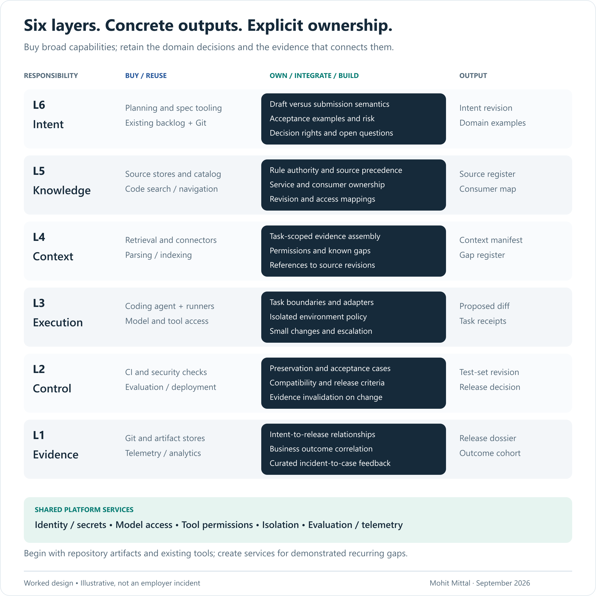

# The ecosystem: six layers with enforceable interfaces

[Read the six-minute story](README.md) · [Inspect the worked example](WORKED-EXAMPLE.md)

The target is AI-assisted delivery into an existing engineering estate. The software being delivered can be an ordinary deterministic service. A development agent and an agent shipped inside a product have different identities, permissions and operating lifecycles.

## 1. Intent: own the meaning of “done”

**Reuse:** the backlog and Git. Adopt specification tooling when it improves elaboration and traceability. [Kiro specs](https://kiro.dev/docs/specs/) illustrate structured requirements, design and implementation tasks.

**Own:** the intent schema and decision rights. At minimum: desired outcome, eligible population, exclusions, invariants, acceptance examples, open questions and named business/service owners. A task list can be generated from these; it cannot resolve them.

**Interface:** an immutable revision of the agreed intent, referenced by subsequent work. In the example, `ONB-017/v1` explicitly distinguishes saving a draft from submitting an application. Unresolved questions have an owner and a consequence: which work can proceed, and which decision must wait.

**Build trigger:** several teams need consistent validation or linking that existing specification tools cannot express. Start with templates and checks; create a service only when those cannot support the operating need.

**Accountability:** product owns the outcome; domain/operations owns the interpretation of examples; engineering owns feasibility. Agreement is a decision record, not three decorative approval boxes.

## 2. Knowledge: establish authority before retrieval

**Reuse:** repositories, document stores, service catalogs and code search. [Backstage](https://backstage.io/docs/features/software-catalog/) is an example of a catalog for service metadata and ownership.

**Own:** source precedence, access rules, freshness and responsibility for unresolved conflicts. In the example, the document-policy owner defines required documents; the service owner defines the current API contract. Neither the newest wiki page nor the most frequently retrieved document automatically outranks them.

**Interface:** a source register containing identity, revision, owner, classification and relationship to the change. Distinguish normative requirements from observations of current behavior. Link evidence of consumers instead of claiming a complete dependency map from one code search.

**Build trigger:** integration with a source or an authority rule is genuinely absent. An adapter may be sufficient. Avoid maintaining another copy of an existing catalog simply because the agent needs JSON.

**Failure to test:** a deprecated example outranks the current rule; a stale owner cannot resolve a conflict; a derived index reveals a source the caller cannot access.

## 3. Context: assemble evidence for a specific decision

**Reuse:** retrieval, parsing, indexes and code-navigation capabilities. [Bedrock Knowledge Bases](https://docs.aws.amazon.com/bedrock/latest/userguide/knowledge-base.html) illustrates managed retrieval; it does not remove the need to verify source-specific permissions.

**Own:** task scope, permission enforcement, revision selection, exclusions, budgets and provenance. The output is an inspectable context manifest, not a claim that all relevant information has been found.

For `ONB-017`, include the approved examples, the save and submit paths, current API contract, document-rule revision and known consumers. Explicitly flag consumers that have not been checked. The agent may recommend a conservative change or an investigation; it must not fill the gap with an invented contract.

**Interface:** `intent revision + task + source revisions + access scope + unresolved gaps`. Store controlled references and relevant excerpts; do not copy secrets or production payloads into a general-purpose task log. Retrieved text is data, not permission to operate tools.

**Build trigger:** repeated context assembly becomes a measured source of delay or inconsistent outcomes across teams. Pilot a versioned pack in Git first. Evaluate the assembler on source correctness, unauthorized retrieval, omitted dependencies and stale evidence—not only semantic relevance.

## 4. Execution: buy the engine; constrain its work

**Reuse:** coding agents, isolated environments, artifact storage and existing CI runners. [GitHub Copilot cloud agent](https://docs.github.com/en/copilot/concepts/agents/cloud-agent/about-cloud-agent) illustrates an agent working through repository changes. Product features, network controls and approval behavior must be checked for the chosen deployment.

**Own:** the allowed task, repository and path scope, permitted tools, budgets, checkpoints and escalation rules. A reusable skill can encode “inspect consumers before changing this contract.” It does not authorize broader filesystem, network or production access.

**Interface:** a proposed change tied to intent and context, plus relevant tool receipts and unresolved issues. Tasks should end in results a reviewer can assess: a consumer map, a compatibility test, a bounded diff. “Continue until the feature works” is a poor contract when success is still ambiguous.

**Build trigger:** a domain tool or approved integration cannot be expressed by the purchased harness. Build that adapter before deciding to build a general orchestration engine. Use durable orchestration such as [Temporal](https://docs.temporal.io/) only where long-running state and recovery warrant it; a normal CI step can remain a normal CI step.

**Model selection:** choose against representative tasks, latency and total task cost. A weaker extraction model that forces repeated correction can cost more overall. Keep authorization, arithmetic and document-rule enforcement deterministic in this example. Evaluate fallback behavior; matching API schemas does not make two models equivalent.

## 5. Control: evaluate against evidence outside the implementation

**Reuse:** CI/CD, dependency/security scanning, API compatibility checks, deployment environments and evaluation runners. [GitHub environments](https://docs.github.com/en/actions/reference/workflows-and-actions/deployments-and-environments) provide deployment controls with plan-dependent availability. [OPA](https://www.openpolicyagent.org/docs) can evaluate policy. [Promptfoo](https://www.promptfoo.dev/docs/intro/) is relevant when evaluating model behavior; deterministic business logic also needs ordinary software tests.

**Own:** risk classification, expected outcomes, test-set integrity, reviewer routing, release thresholds and exception handling. Using a second model to review code may help, but two models can inherit the same wrong requirement. Independent evidence means an authoritative source or separately maintained expected result, not merely a different agent name.

For the example, include both preservation tests for draft saving and change tests for submission. Check the actual consumers identified in discovery. Keep additional domain cases outside the agent's immediate optimization loop and record how they were selected. A passing sample is not proof that every document category is correct.

**Interface:** an evaluation record bound to code, rule, configuration and test-set revisions, with unresolved failures and a named release decision. If an input changes, determine which evidence must be rerun. Do not carry forward an approval whose assumptions no longer hold.

**Build trigger:** business-specific checks and risk routing are missing. Implement them in existing pipelines where possible. A separate approval portal can add another queue without improving the decision.

## 6. Evidence: make change impact and learning possible

**Reuse:** Git, artifact storage, telemetry, incident management and analytics. [Langfuse](https://langfuse.com/docs) is an example for agent/model observability and evaluations. [OpenTelemetry GenAI conventions](https://github.com/open-telemetry/semantic-conventions-genai) offer evolving instrumentation conventions; pin the versions you use.

**Own:** the relationship between intent, sources, task, change, evaluation, release and outcome. Git files and identifiers can implement an initial relationship model. A graph database is optional; traversable links and maintained ownership are essential.

**Interface:** the release dossier in the [worked example](WORKED-EXAMPLE.md), plus an outcome record. For a rule change, it should be possible to identify the affected tests, work in progress and released configurations. Record any limits in that dependency coverage.

Agent observability should answer: what task was attempted, which source revisions were supplied, which tools ran, where attempts failed, what the reviewer changed, and what effort/cost accumulated? Record concise decision factors and evidence references, not hidden model reasoning.

Product observability answers a different question: did this release allow drafts to save, correctly classify submissions and improve operations? Link the views through a release identifier. Keep permissions, retention and sampling appropriate to each. If the shipped product itself contains agents, it additionally needs runtime tool/decision traces; an AI-assisted build does not imply an AI runtime.

**Build trigger:** existing tools cannot correlate the required artifacts or answer recurring operational questions. Build the missing links. Do not centralize unrestricted prompts, source code and customer data merely to make the dashboard convenient.

## The shared services across the layers

| Capability | Reuse or buy | Enterprise-owned boundary |
|---|---|---|
| Identity and secrets | Enterprise IAM, workload identity, secret manager | Development-agent scope, delegated access, environment separation and revocation. |
| Model access | Approved providers and gateway capabilities | Routing, data-residency requirements, quotas, fallback evaluation and cost attribution. |
| Tool connectivity | Existing APIs, gateways and MCP-compatible tooling where useful | Typed domain adapters, destination authorization, schema versions and receipts. MCP is an interface, not a business entitlement system. |
| Execution environments | Existing cloud, CI, artifact and dependency services | Isolated templates, network policy, dependency provenance and cleanup. |
| Evaluation and telemetry | Existing test infrastructure, trace collection and AI evaluation tools | Domain labels, capture coverage, redaction, retention and response ownership. |
| Asset lifecycle | Git and existing catalogs/registries | Owners and versions for prompts, models, tools, skills, rules and evaluation sets; retirement of obsolete assets. |

## The build/buy decision I would put in front of a CTO

Run the same representative change through the available options. Test access boundaries, context export, evidence export, recovery and integration with the existing review process. Include one vendor/model substitution to expose hidden coupling. An abstraction can reduce migration work; it does not eliminate different behavior, formats or operating constraints.

Compare license cost, integration, model consumption, evaluation, human review, support and exit cost. An internal build has an on-call and maintenance commitment; a purchase has integration and governance obligations. Name both owners before presenting a cost comparison.

**Buy the broad capability when it fits. Own the domain decision and its evidence. Build where a demonstrated gap requires it.** Revisit the boundary when a second team adopts the system, because that is when supposedly shared infrastructure encounters a different domain.

These are architecture choices and illustrative product capabilities, not a validated interoperable procurement stack. [Source notes](SOURCES.md).
