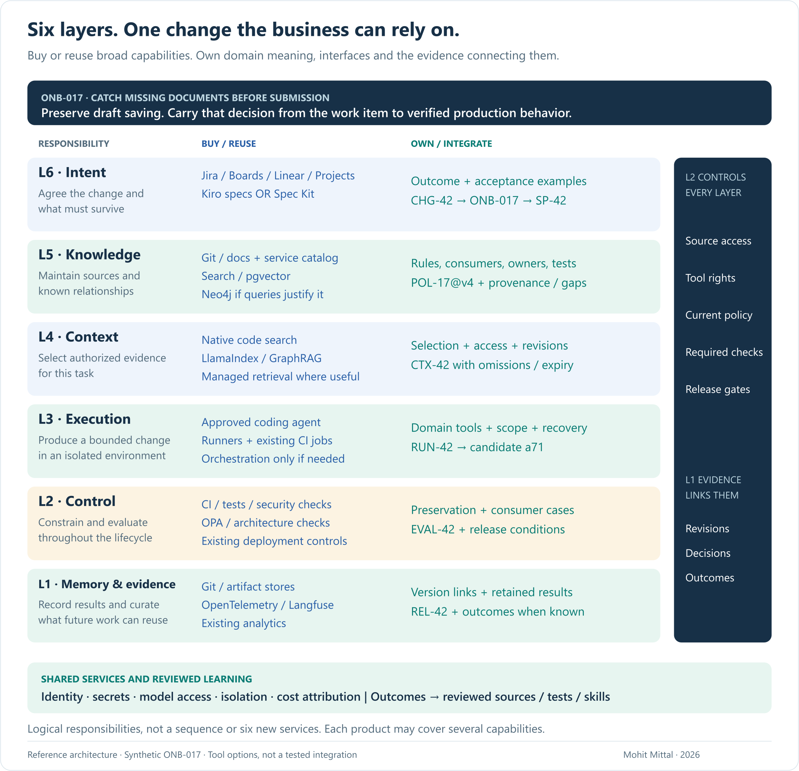

# Ecosystem architecture

The current architecture is consolidated in [Six Layers for Intent-Driven AI Delivery](PAPER.md). Start with the [six-minute brief](README.md).

The full paper covers work tracking and specifications, enterprise knowledge and graphs, task context, agent execution, evaluation/control, memory/evidence, build/buy decisions, cross-layer contracts, patterns and operating measures.

[Operating field guide](FIELD-GUIDE.md) · [Optional worked example](WORKED-EXAMPLE.md) · [Sources](SOURCES.md)
