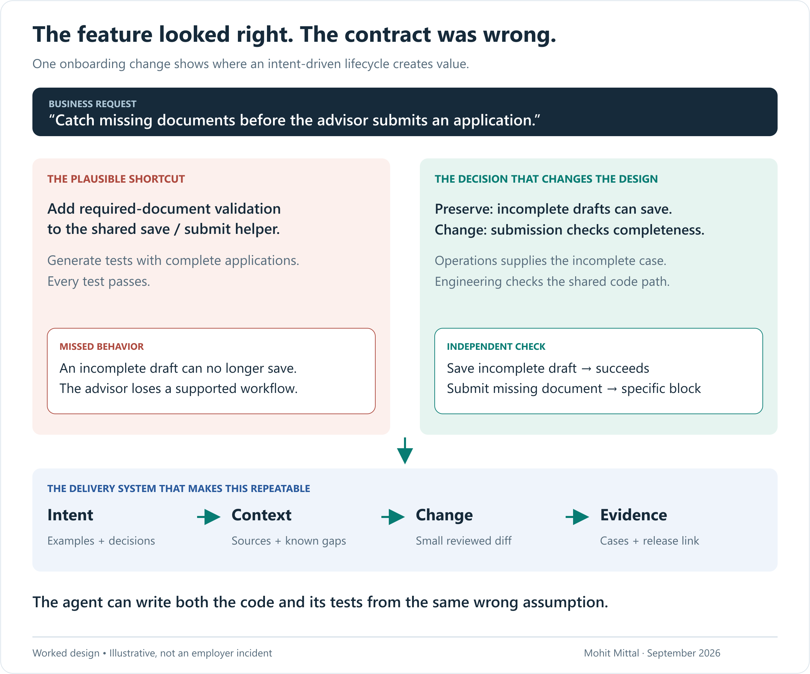
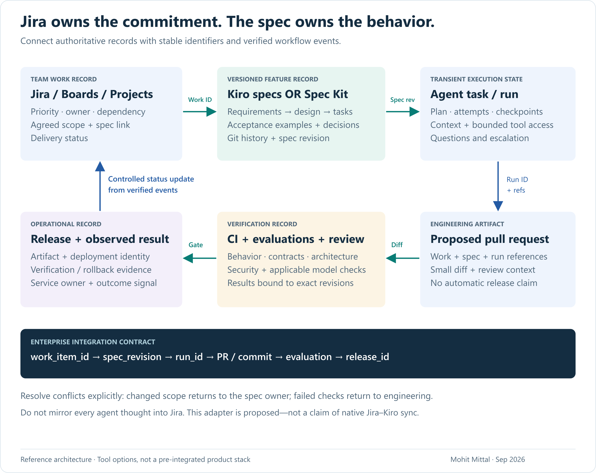
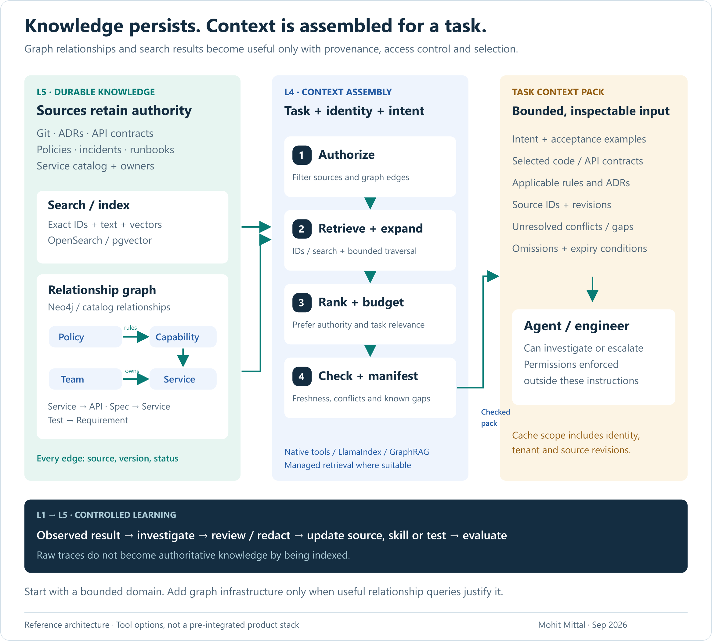
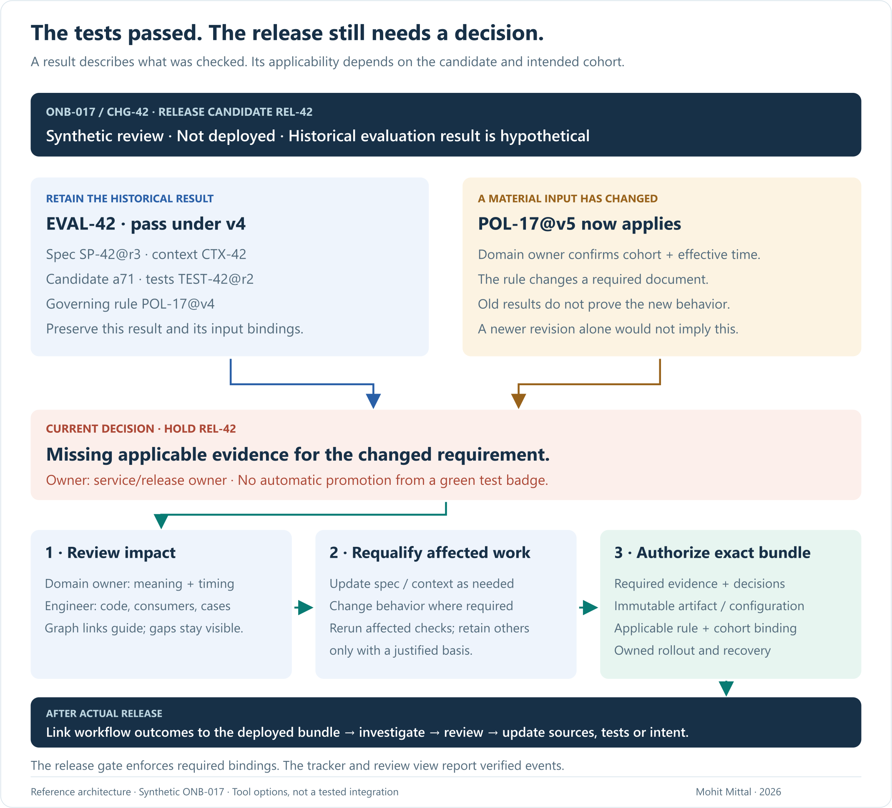

# From Intent to Production: a six-layer delivery architecture

### Preserve business intent through specifications, knowledge, context, execution, control and evidence

*Mohit Mittal · September 2026*

**Buy or reuse the coding agent. Own the context, domain decisions and verification that make its changes fit your business.** The architecture connects an agreed outcome to an accepted production change. The lasting assets are authoritative sources, maintained contracts and evidence that remains interpretable when a rule, implementation or tool changes.

The six layers are **Intent, Knowledge, Context, Execution, Control, and Memory & Evidence**. They are logical responsibilities with interfaces, not six sequential project phases or six services to buy. A product can span layers; controls and evidence apply throughout. Tool substitution still requires integration and evaluation.

[Six-minute brief](README.md) · [Worked artifacts](WORKED-EXAMPLE.md) · [Operating field guide](FIELD-GUIDE.md)

## One change makes the architecture concrete

“Catch missing documents before an advisor submits an application.” In synthetic intent **ONB-017**, the obvious implementation adds a required-document guard to a helper shared by save and submit. Generated tests using complete applications all pass. An incomplete draft can no longer save.

The code and tests agree with each other; both omit a required behavior. Operations must supply the incomplete-draft example. Engineering must find the shared path and supported consumers. Product must agree that preserving draft saving is part of success. This is an illustrative failure, not an employer incident.

The architecture must carry those decisions through to production, including when their inputs change. We use one connected set of synthetic records: tracker item **CHG-42**, intent **ONB-017/v1**, specification **SP-42@r3**, rule **POL-17@v4**, context **CTX-42**, run **RUN-42**, candidate commit **a71**, evaluation **EVAL-42** and release candidate **REL-42**. These are illustrative labels, not live IDs or executed evidence.

The feature is an ordinary application change; it need not contain an LLM at runtime. AI helps discover, design and implement it. The separate [Earned Autonomy paper](https://github.com/appliedgenai/earned-autonomy) addresses permission for agents acting on live business workflows.

## The six-layer architecture

## What AI-DLC, Kiro and the Fowler literature contribute

[AWS's AI-DLC framing](https://aws.amazon.com/blogs/devops/ai-driven-development-life-cycle/) connects inception, construction and operations through AI proposals and human decisions. This paper supplies a proposed architecture for that work in an existing enterprise; its six layers are not an AWS-prescribed stack.

[Kiro's specs](https://kiro.dev/docs/specs/) make requirements, design and tasks concrete artifacts. Its [steering](https://kiro.dev/docs/steering/) carries reusable project guidance; [hooks](https://kiro.dev/docs/hooks/) trigger commands or agent prompts; [MCP support](https://kiro.dev/docs/mcp/) exposes external tools and context. These mechanisms illustrate how a developer-facing product can participate in the architecture. They do not decide the firm's source ownership, work-item semantics or risk policy.

Birgitta Böckeler, writing on Martin Fowler's site, distinguishes **spec-first**, **spec-anchored** and **spec-as-source** development. The distinction is useful: a specification written once is different from one maintained through future changes, and both differ from treating specifications as the only human-edited source. Her analysis also challenges excessive specification overhead. [SDD analysis](https://martinfowler.com/articles/exploring-gen-ai/sdd-3-tools.html)

My proposed default for important, long-lived features is a maintained specification alongside code and executable contracts. A small correction can use a lighter path. Humans continue to inspect and edit code. Regenerating a large legacy application solely from prose is not an assumption of this architecture.

## L6 — Intent and specification

**Question:** What outcome are we delivering, for whom, under which constraints, and what evidence will count as done?

This layer contains product intent, scope, acceptance examples, architecture decisions and the implementation plan. It must distinguish business requirements from a chosen technical solution, while keeping them linked. Product and domain experts approve meaning; engineers establish feasibility and design.

### Is task management Jira or something else?

Use the established work-management system when it already supports the organization. [Jira](https://www.atlassian.com/jira/solutions/planning), [Azure Boards](https://learn.microsoft.com/en-us/azure/devops/boards/get-started/what-is-azure-boards?view=azure-devops), [Linear](https://linear.app/docs) and [GitHub Projects](https://docs.github.com/en/issues/planning-and-tracking-with-projects/learning-about-projects/about-projects) are alternatives, not four systems to install. Select for portfolio needs, workflow/reporting, repository integration and team adoption. Switching trackers is not a prerequisite for AI-DLC.

In this proposed record-authority model, distinguish three records. A suite may host more than one; the point is to make conflict resolution explicit:

| Record | Authority | Recommended contents |
|---|---|---|
| Team work item | Jira, Boards, Linear or Projects | Priority, owner, dependency, delivery status and links to the agreed specification and release. |
| Feature specification | Versioned repository artifacts | Requirements, design, acceptance examples, decisions and references to authoritative rules. |
| Agent execution plan | Harness/task state | Temporary steps, attempts, checkpoints and unresolved questions for the current run. |

[Kiro](https://kiro.dev/docs/specs/) and [GitHub Spec Kit](https://github.github.com/spec-kit/reference/agentic-sdd.html) support specification workflows. Choose a primary workflow for a team; do not impose duplicate artifact trees simply to adopt both. Kiro's requirements/design/tasks structure is a useful starting point. Spec Kit's optional `/speckit.taskstoissues` conversion requires a GitHub origin remote and GitHub MCP issue tools. Neither eliminates the need to decide which record is authoritative.

**Integration contract:** attach a work-item ID to the spec; reference spec and requirement IDs in implementation tasks and PRs; link evaluation and release records back to the work item. Let controlled workflow events update delivery status. An agent checking a task box must not independently declare the business feature released. Avoid mirroring every internal reasoning step into Jira.

**Buy/adopt:** work tracking and specification tooling. **Own:** artifact conventions, decision rights, ID/linking rules and the adapter that connects approved workflow events. This is a proposed integration pattern, not a claim of automatic native Jira–Kiro synchronization.

Atlassian is also extending Jira toward agent execution. Its September 10, 2026 announcement describes agent loops, Standards and AI Review as private early access. Evaluate tenant availability and control behavior before depending on them. Architecture boundaries remain useful even when a suite implements several capabilities. [Current announcement](https://www.atlassian.com/blog/jira/governed-agent-loops)

## L5 — Enterprise knowledge

**Question:** What does the organization know, which sources are authoritative, and how do its systems and obligations relate?

The source estate already exists: Git repositories, ADRs, API schemas, Confluence or SharePoint documents, service catalogs, policies, incidents and runbooks. The knowledge layer registers and indexes that material with its owners, versions and permissions. It does not require moving all content into a new database.

Use three complementary representations:

- **Source documents and code** preserve detailed authoritative material.
- **Search indexes** support exact names, identifiers and semantic similarity. [OpenSearch](https://docs.opensearch.org/latest/vector-search/) and PostgreSQL with [pgvector](https://github.com/pgvector/pgvector) are implementation options with different operating profiles.
- **A knowledge graph** represents relationships needed for impact analysis and reasoning across sources. [Neo4j and its GraphRAG tooling](https://neo4j.com/docs/neo4j-graphrag-python/current/user_guide_rag.html) are options for graph and hybrid retrieval. [Backstage](https://backstage.io/docs/features/software-catalog/) can contribute service ownership and catalog metadata; a service catalog is not automatically a complete enterprise knowledge graph.

### What goes into the graph?

A useful initial ontology might connect:

`Policy → governs → Capability → implemented_by → Service → exposes → API`

`Team → owns → Service`; `Spec → changes → Service`; `Test → verifies → Requirement`; `Incident → affects → Release`.

Connect those branches with `Requirement → belongs_to → Spec` and `Requirement → implements → Policy` where those relationships are established.

That supports a concrete question: **“If this onboarding rule changes, which services, owners, specifications and tests should we investigate?”** Vector similarity can find related text; graph traversal can follow explicitly represented dependencies. The two approaches complement each other.

Every important relationship needs provenance, a source revision, timestamps and an owner or validation status. A relationship extracted by an LLM should enter as a candidate where verification matters. Handle corrections, deleted sources, stale edges and permission changes. An attractive graph containing unverified edges can spread incorrect assumptions more efficiently than a wiki.

For example, an illustrative impact result for `POL-17@v4` might return:

| Candidate affected service | Owner / requirement / test | Provenance and gap |
|---|---|---|
| `application-service` | Onboarding team / `REQ-42` / `submit_missing_document` | Spec `SP-42@r3`, service catalog revision `c18`; owner-validated edge. |
| `document-service` | Documents team / requirement mapping unresolved | API dependency observed at commit `a71`; policy relationship awaits domain review. |

This is a candidate investigation set, not proof of complete impact coverage. Source search supplies the actual rule passages; traversal supplies the relationship paths. Compare graph results with reviewed changes in a bounded system inventory, and record maintenance effort alongside dependency coverage.

Start with a bounded domain and demonstrated relationship queries. If catalog links and ordinary search answer them adequately, a graph database can wait. A graph is justified by useful queries and maintained relationships, not by the label “agentic.”

**Buy/adopt:** source platforms, catalog, index and graph engine. **Own:** ontology, entity resolution, source precedence, permission propagation, ingestion quality and stewardship. The domain owns semantics; the platform owns reliable access and indexing.

## L4 — Context engineering

**Question:** Given this task, identity and stage of work, what should the agent see now?

Knowledge is persistent and broad. Context is a bounded selection assembled for a particular task. The same repository needs different evidence for design, implementation, security review and incident diagnosis.

The assembler receives task identity, intent revision, actor/workload scope and the decision being attempted. It applies access restrictions, retrieves by identifiers/text/vector similarity, expands relevant graph relationships, ranks and trims evidence, and emits source references plus unresolved gaps. Authorization must govern both graph traversal and returned content; relevance is not permission.

A practical context pack contains the selected requirements, applicable ADRs, relevant code and API contracts, domain examples, constraints, source revisions and known unknowns. It also records what was omitted for budget or availability reasons. Scope caches to the relevant identity, tenant and source revision. Permission revocation and deletion need a defined path into derived stores.

**Tool options:** [LlamaIndex](https://developers.llamaindex.ai/python/framework/) for ingestion/retrieval and context augmentation; Neo4j GraphRAG for relationship-aware retrieval; managed retrieval such as [Bedrock Knowledge Bases](https://docs.aws.amazon.com/bedrock/latest/userguide/knowledge-base.html); the coding agent's native search and file tools. Select the combination the task requires. A small repository may need no external retrieval framework.

Reusable guidance, task instructions, skills, tool descriptions and runtime observations all consume context. Böckeler's [context-engineering analysis](https://martinfowler.com/articles/exploring-gen-ai/context-engineering-coding-agents.html) is useful here: loading mechanisms and scope matter. Apply general guidance sparingly, load domain detail when relevant, and enforce critical restrictions outside the prompt.

**Buy/adopt:** retrieval primitives and connectors. **Own:** task-specific assembly policy, source ordering, access checks, context manifests and evaluations for omissions, stale evidence and unauthorized retrieval. Build a shared assembler when repeated use and measured failures justify it; start with versioned repository packs when they suffice.

## L3 — Agent execution and orchestration

**Question:** Which agent or deterministic step performs the work, with which tools, permissions, budget and recovery behavior?

A coding harness manages the working loop around a model: instructions, context, tool calls, observations, state and stopping. The product supplies a built-in harness. The enterprise still supplies its own guidance and feedback around it: domain examples, maintained context, architecture checks and release integration. Buying the former does not complete the latter. This distinction follows Böckeler's [coding-agent harness analysis](https://martinfowler.com/articles/harness-engineering.html). [Kiro](https://kiro.dev/) and [GitHub Copilot cloud agent](https://docs.github.com/en/copilot/concepts/agents/cloud-agent/about-cloud-agent) are examples of purchased/general-purpose execution capabilities. Prefer adapting a suitable harness before owning a new one.

Provide isolated workspaces, scoped credentials, tool allowlists, environment templates and reviewed domain adapters. A skill can describe how to update an API contract; it cannot grant production access. MCP is one connectivity mechanism. Its security model and destination authorization remain necessary even when the tool description sounds safe.

**A minimal integration topology:** place the versioned spec and an access-appropriate context pack/manifest in the isolated working repository. The selected harness reads these files and produces a candidate diff. Where supported, expose additional retrieval through a scoped tool or MCP interface. Protected CI evaluates the resulting commit; repository, environment and destination permissions enforce the release boundary independently of agent instructions.

Before buying, demonstrate context delivery, credential scope, isolation, cancellation and export of the evidence available in the intended IDE/CLI/cloud mode. Capabilities differ by mode. If required controls are unavailable, limit that mode to drafting/review or select another supported deployment. An adapter cannot create a product guarantee that does not exist.

Use deterministic orchestration for known sequences such as build, test and deploy. Use agent decisions where investigation and interpretation add value. For custom stateful agent workflows, [LangGraph](https://docs.langchain.com/oss/python/langgraph/overview) offers orchestration primitives. [Temporal](https://docs.temporal.io/) addresses durable workflow execution. These are different capabilities, and neither is a mandatory addition to an existing CI pipeline.

Parallel agents are useful for genuinely separable work. Partition ownership, isolate changes and define reconciliation. Otherwise they create conflicting edits and a larger review queue. A separate review agent provides another assessment, not automatically independent evidence.

Model selection should use task evaluations: extraction, code analysis, planning and semantic review may need different cost/latency/quality tradeoffs. Track total successful-task cost, including retries and human correction. Evaluate fallbacks before use. Keep permission decisions and critical invariants deterministic.

**Buy/adopt:** models, coding harnesses, runners and orchestration primitives. **Own:** domain adapters, decomposition, isolation, budgets, escalation and integration with control/evidence interfaces. Custom orchestration has a maintenance and on-call cost; a polished prototype is not an operating model.

## L2 — Evaluation and control

**Question:** What may this run do, and what evidence permits a change to merge and ship?

Control runs throughout the lifecycle. It checks context access, constrains tool execution, evaluates artifacts and governs release. It must not be interpreted as a single approval meeting after code generation.

Use an evaluation ladder: intent consistency and acceptance examples; context/source correctness; deterministic unit/integration/contract tests; security and architecture checks; model-behavior evaluations where a model is involved; and observed production outcomes. Calibrate model judges against labeled cases and review their errors.

**Tool options:** existing CI such as GitHub Actions; [OPA](https://www.openpolicyagent.org/docs) for policy decisions; language/framework testing; [ArchUnit](https://www.archunit.org/) for Java architecture constraints; [Promptfoo](https://www.promptfoo.dev/docs/intro/) for AI evaluations; protected deployment environments and existing release systems. An ordinary deterministic feature does not require an LLM evaluation framework merely because an agent helped write it.

An architectural fitness function makes a rule inspectable: forbidden dependency edges, contract compatibility, restricted data flows or required provenance. Prefer deterministic checks when they can express the requirement. Human review and semantic evaluation address what those checks cannot establish. Böckeler's [harness-engineering framework](https://martinfowler.com/articles/harness-engineering.html) connects guidance with this kind of feedback.

Bind evaluation evidence to code, spec, source, rule, model/tool and configuration revisions as applicable. Material changes trigger impact review and reruns. Local hooks improve feedback speed; protected repository, environment and destination controls enforce the boundary within the defined trust model. Administrator exceptions and bypass permissions require separate governance and evidence.

**Buy/adopt:** policy/testing/security/deployment tools. **Own:** risk classification, expected outcomes, evaluation sets, reviewer routing, exceptions and release criteria. Domain experts supply difficult examples before implementation. Engineers own merged behavior. Security and risk partners define proportionate controls.

## L1 — Memory, evidence and organizational learning

**Question:** What happened, what can be trusted later, and what should change the next run?

Keep three stores logically distinct, even if some share infrastructure:

| Store | Purpose | Lifecycle |
|---|---|---|
| Working memory | Task checkpoints, attempts and temporary observations | Scoped to the run; expires or is retained selectively. |
| Curated organizational memory | Reviewed decisions, reusable skills, corrected guidance and regression cases | Owned, versioned, reviewed and retired like other engineering assets. |
| Evidence | Inputs/references, approvals, evaluations, tool receipts, releases and observed results | Access and retention follow the record's purpose and applicable policy. |

Git, relational/object storage and existing incident systems can supply the foundation. [OpenTelemetry GenAI conventions](https://github.com/open-telemetry/semantic-conventions-genai) and [Langfuse](https://langfuse.com/docs) offer instrumentation/analysis capabilities. Pin evolving conventions, manage sensitive content deliberately and keep stable links across work item, spec, context, run, PR, evaluation and release.

Agent observability should explain failed tool calls, repeated attempts, context gaps, reviewer corrections, latency and cost. Product observability should show whether the delivered capability achieved its purpose. Join through release identity; do not assume successful inference means successful delivery or business completion.

The learning loop is **observe → investigate → review/redact → update a test, source or skill → evaluate → publish the new version**. Raw traces do not become trusted knowledge merely by being embedded. An incident-driven rule change should be traceable back to the evidence that justified it.

**Buy/adopt:** collection, storage and analytics. **Own:** correlation, evidence classification, access/retention, capture coverage and curation. The knowledge layer serves approved assets; this layer records experience and controls promotion into those assets.

## One concrete reference deployment

For an enterprise already using Jira and GitHub, I would evaluate this combination:

| Layer | Candidate implementation | Enterprise-owned addition |
|---|---|---|
| Intent | Jira + Git-versioned Kiro specs **or** Spec Kit | Work/spec/PR identifiers and workflow-event synchronization. |
| Knowledge | Git/Confluence + Backstage; Neo4j where relationship queries justify it; existing search | Domain ontology, source precedence, ingestion and access mappings. |
| Context | Native code search + LlamaIndex/GraphRAG only where needed | Context-pack assembly, provenance, gap reporting and evaluation. |
| Execution | Kiro or approved coding agent + existing isolated runners | Domain tool adapters, task boundaries and enforced environment policy. |
| Control | Existing CI/tests + relevant policy, architecture and AI-evaluation tools | Risk rules, domain cases, review routing and release conditions. |
| Memory & Evidence | Git/artifact store + existing telemetry, augmented with agent tracing | Correlation model, curated learning and lifecycle ownership. |

This is a reference configuration to test, not a validated procurement bundle. Cross-cutting services include enterprise identity, secrets, model access/routing, tool gateways, data lifecycle, evaluation and cost attribution. Preserve existing enterprise services wherever their interfaces meet the need.

### One change across all six layers

The ONB-017 records introduced above show what each layer exchanges. Every row refers to the same change. Product and domain owners establish meaning; the platform preserves links and current applicability. This is not a vendor schema.

| Layer / accountable owner | Exchanged artifact | Failure or change rule |
|---|---|---|
| Intent / product + engineering | `CHG-42`, intent `ONB-017/v1`, spec `SP-42@r3`, requirement `REQ-42`, acceptance cases | A material scope change creates a new baseline and impact review; do not silently replace an in-flight run's spec. |
| Knowledge / domain source owner | `POL-17@v4`, source revision and validated relationship references | Conflicting authoritative rules go to the domain owner; a missing rule is not permission to infer one. |
| Context / platform with domain owner | `CTX-42`, actor/tenant scope, selected source revisions, omissions, retrieval status and expiry | Optional gaps are visible; missing required evidence pauses the affected step. An outage must not look like a successful empty search. |
| Execution / service engineering | `RUN-42`, `CTX-42`, tools/configuration, checkpoints, proposed PR and commit `a71` | Resume from recorded state with fresh authorization checks. Unresolved questions remain attached to the run. |
| Control / service owner + reviewers | `EVAL-42`, commit `a71`, spec `r3`, test-set/rule revisions, unresolved checks | Preserve historical results; review applicability when relevant inputs change. Required current evidence missing means no release. |
| Memory & Evidence / service owner | Release candidate `REL-42`; deployment/outcome records when they exist; unique event ID and upstream references | Duplicate events are idempotent. Tracker-sync failure queues repair and exposes lag; it never triggers another deployment. |

The failure boundary is explicit: unavailable required authorization or release evidence blocks the affected action; an unavailable convenience dashboard can lag under an owned repair process. Every adapter needs an owner, retry/reconciliation rules and a declared fail-or-continue behavior. These are proposed contracts to implement and test, not native integrations implied by the tool list.

Build-versus-buy should compare integration, support, evaluation, security, migration and exit cost alongside licenses. Test representative work—including stale knowledge, access denial, tool failure and a model/provider substitution—before declaring the components interchangeable.

## A passing evaluation is a claim about a particular candidate

Imagine the corrected candidate preserves draft saving and passes the agreed tests under **POL-17@v4**. Before release, its domain owner makes **v5** effective for the intended cohort, with a changed document requirement. The code may be unchanged, but the proposed production behavior now includes a different rule.

Keep EVAL-42 as a historical result for its original input bundle. Hold REL-42 because that evidence does not establish the new requirement. The domain owner confirms applicability and effective time; engineering identifies affected code, consumer contracts and cases; the platform finds linked contexts and open changes. Unknown dependencies remain an investigation gap.

Update the specification and affected context, adapt code/configuration if necessary, rerun the affected checks and refresh the release decision. Retain unrelated results when their applicability is justified. A newer source revision alone is not enough to cancel every result: a future-effective rule, formatting correction and material current behavior change have different consequences.

| Change | What to reconsider | What must not be inferred |
|---|---|---|
| Effective rule changes for the target cohort | Relevant requirements, context, behavior, acceptance cases and release criteria | Old tests passing means the new rule is implemented. |
| Context access is revoked | Retrieval authorization, derived caches and access to retained evidence | Relevance or an old manifest grants continuing access. |
| Candidate artifact/configuration changes after approval | Results and approval applicable to the exact proposed release bundle | Approval transfers to a different build because its branch name is unchanged. |
| Coding-agent model changes; application artifact does not | Provenance and evaluations for future development runs | All deterministic application test results are automatically invalid. |
| A model/prompt/retrieval configuration shipped in the product changes | Behavior evaluations and release criteria for that runtime component | The developer-tool and product-runtime changes have identical effects. |
| Tracker/telemetry synchronization is delayed | Evidence capture requirements, lag and repair ownership | A dashboard problem requires redeploying the application. |

The release manifest identifies immutable artifact digests and the applicable spec, rules, configuration, test-set results and required decisions. If rules are dynamic, record which resolver/version applies to which cohort and effective time, and check that binding at deployment or activation. Do not make a release claim against a mutable label such as “latest.”

A minimum implementation can use repository metadata, CI artifacts and a small validation adapter; it does not require a central platform or graph for every check. The deployment service checks the required bindings and current release authorization. A dashboard shows the decision; it cannot manufacture missing evidence. Administrators and emergency exceptions remain within the firm's explicit control model.

The [change manifest](examples/change-manifest.json) illustrates a held candidate; the [revalidation cases](examples/revalidation-cases.json) specify failure and recovery behavior. Both are unexecuted design artifacts. The example does not claim a functioning gate or passing integration tests.

## Patterns, anti-patterns and tradeoffs

| Pattern | Anti-pattern | Tradeoff to acknowledge |
|---|---|---|
| Spec-anchored evolution with small changes | Generate a large specification once and assume control | Specification maintenance and review are recurring work. |
| Jira tracks team commitments; specs define behavior | Duplicate the full specification and every agent step across trackers | Integration and conflict-resolution rules need owners. |
| Evidence applicability by input and change type | Rewrite historical results or invalidate every check on every change | Dependency mapping and impact review have a cost; unknowns stay visible. |
| Curated graph plus search | Infer every relationship and treat all edges as fact | Ontology, validation and freshness cost engineering time. |
| Task-scoped context with provenance | Connect every source and load everything | Missing-evidence detection and retrieval evaluation remain necessary. |
| Deterministic gates plus semantic review | Treat prompt rules or a second agent as enforcement | Some judgment stays with humans; review capacity limits throughput. |
| Stable domain interfaces around purchased agents | Fork a harness for each team | Shared interfaces need versioning, support and an internal roadmap. |
| Curated feedback into tests and knowledge | Append all traces to long-term memory | Useful learning requires review, redaction and deletion. |

## People, process and measurement

Product owns intent and benefit. Domain experts own meanings and acceptance examples. Engineers own design and merged correctness. Platform teams own reusable interfaces and environments. Security/risk partners own applicable constraints. Service owners own release and recovery. An evaluation owner maintains expected outcomes; this can be a responsibility inside an existing team.

Use short cycles of elaboration, design, construction, evaluation and outcome review. Non-coders can contribute specifications, examples and bounded prototypes. Production changes retain engineering ownership and risk-proportionate controls. Preserve mentoring and system understanding; generated artifacts do not remove the need for people who can diagnose them.

Measure at the service/team level, disclose cohort selection and include abandoned attempts:

| Question | Measure |
|---|---|
| Did delivery improve? | Intent-to-production median/p90 and time waiting for review; keep active effort separate. |
| Did quality hold? | Change fail rate, failed deployment recovery time and deployment rework rate; separately track review rework and defects by severity. |
| Does knowledge/context work? | Source freshness, known dependency coverage, relevant authoritative evidence in sampled packs, access-control failures and unresolved gaps. |
| Did the economics improve? | Total human, model, tool and allocated platform cost across attempts per accepted change. |
| Can we explain the result? | Valid linked evidence records / expected records for the change class. |
| Did the business benefit? | Workflow-specific completion, handling effort, exception age and adoption. |

[DORA](https://dora.dev/guides/dora-metrics/) defines five delivery measures: change lead time (commit to production), deployment frequency, failed deployment recovery time, change fail rate and deployment rework rate. Intent-to-production, review waiting, context/evidence quality, total cost and business outcomes are supplemental measures proposed here.

Define an accepted change as deployed and meeting its agreed acceptance conditions. Allocate failed and abandoned attempt costs to the evaluated cohort. Measure dependency coverage against reviewed changes in a declared inventory, with unknown dependencies reported as a limitation. A lower token bill alone does not establish lower delivery cost.

Start with the current tracker, repository, approved agent and CI. Add bounded sources and traceable specifications. Introduce a graph or shared context service when repeated relationship queries or assembly failures justify it. Prove reuse with a second team before treating a pilot's shortcuts as enterprise standards.

Budget recurring work: platform teams maintain connectors, permissions and agent/tool upgrades; domain owners steward source meanings and graph relationships; engineers maintain evaluations; service owners support recovery. Include this effort in the economics, rather than treating the pilot's integration work as a one-time expense.

The durable asset is a delivery system that preserves intent, knows its sources, constrains execution and learns from verified outcomes. **Fund the interfaces and their operating owners; expand when a second team can reuse them with its own domain evidence and measurable benefit.**

---

**Author perspective:** Mohit Mittal's background includes enterprise architecture, production LLM/RAG work at Chegg, and governed agent infrastructure and MCP servers in healthcare. This is an independent proposal informed by that experience and the sources below; the candidate product combinations and synthetic artifacts are not claimed employer deployments.

[Executive overview](README.md) · [Research sources](SOURCES.md) · [Separate runtime paper: Earned Autonomy](https://github.com/appliedgenai/earned-autonomy)

