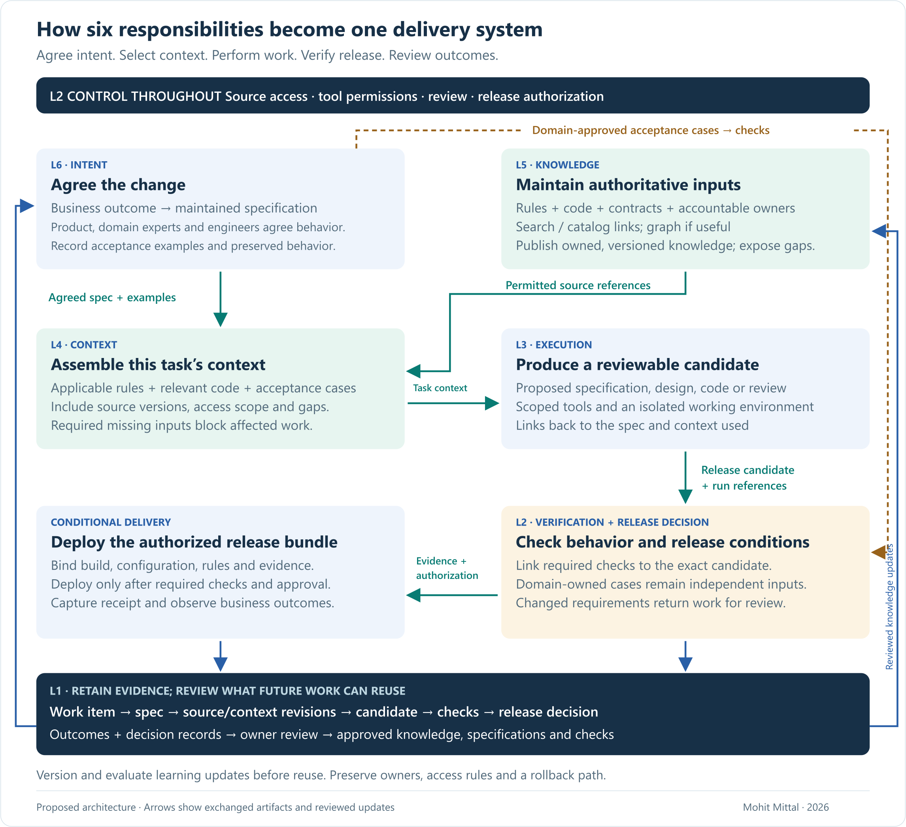

# From Intent to Production

### A Six-Layer Architecture for AI-Driven Software Delivery

A leader’s guide to connecting intent, knowledge, AI-assisted work and verified releases.

**A six-minute guided overview · Mohit Mittal · September 2026**

**Enterprise AI-DLC is a connected delivery system:** an agreed business change becomes a maintained specification; relevant enterprise knowledge becomes context for AI-assisted work; the resulting code, checks and release decision remain linked.

**For leaders establishing AI-native delivery, the decision is architectural:** connect six responsibilities across people, process and technology. A coding agent and its harness cover part of execution; they do not establish the whole delivery capability. Make a **build-versus-buy decision at each layer**, including reuse of existing platforms.

- **Intent drives the work:** the agreed outcome and acceptance examples follow the change beyond the Jira ticket.
- **Knowledge becomes task context:** agents receive applicable, permitted sources with known gaps.
- **Evidence closes the loop:** checks support release decisions; reviewed production outcomes improve future specifications and tests.

**Think of it as an AI-native software factory:** a repeatable delivery capability that improves through reviewed experience. Outcomes and decision records feed better knowledge, task context, specifications and checks for the next change.

## 1 · Follow one business request through the system

Consider fictional onboarding change **ONB-017**: **“Reduce applications returned for missing documents, without interrupting an advisor's draft work.”**

The request enters Jira as **CHG-42**. The document rules, application code and service ownership records live elsewhere. The team must bring them together, agree the behavior, implement it and establish whether the resulting software can ship.

That is the work this architecture connects:

*Arrows identify exchanged artifacts. The layers are logical responsibilities; control and evidence operate throughout. This is a proposed integration, not an implemented workflow. Select any diagram for full resolution.*

## 2 · What each layer contributes to this change

**L6 · Intent — turn the request into an agreed specification.** Product, operations and engineering agree that incomplete drafts must save, while submission checks the applicable document requirements. A maintained specification records these examples and links back to the work item. It gives the agent and reviewers a shared definition of success.

**L5 · Knowledge — establish the sources the change must respect.** The specification references document rule **POL-17**, relevant code, supported interfaces and known owners. Search and catalog links may suffice. A knowledge graph can help answer repeated questions such as “which services and tests depend on this rule?” Its relationships need provenance and maintenance.

**L4 · Context — select what each task needs.** Requirements, design, coding and verification need different context. Here, implementation receives the relevant rule revision, save/submit code, interface contracts and acceptance examples as **CTX-42**, with source references, access checks and unresolved gaps. Maintaining a knowledge store does not automatically produce this selection. Required missing information pauses the affected work.

**L3 · Execution — perform bounded development tasks.** AI can draft requirements, explore designs, implement changes or assist verification; each task needs scoped tools, review and stopping rules. Here, an approved coding agent proposes a linked candidate in isolation. Deterministic build tools still do their established work.

**L2 · Control — check the candidate against independently agreed behavior.** Access and execution controls apply throughout; CI also receives domain-owned acceptance cases. One preservation check asks whether an incomplete draft still saves. It catches a plausible mistake: adding the document check to code shared by save and submit. Completing the agent's task does not authorize release.

**L1 · Memory & evidence — retain the change's history and learn from outcomes.** Link inputs, candidate, checks and decisions to the release record. After an authorized deployment, capture its receipt and business outcomes. Decision records capture sources, alternatives, rationale and approvals. Review failures and outcomes before updating knowledge, context policies or tests; raw traces are not trusted guidance.

## 3 · Make build-versus-buy decisions across the architecture

**Buy or reuse** established capabilities where they fit. **Build or adapt** domain components and missing integrations when a demonstrated gap justifies their lifecycle cost. The enterprise remains accountable for business rules, access, acceptance and release decisions in either choice. A knowledge graph or custom orchestration is conditional, not a prerequisite.

For example, **Jira records priority and status; a maintained specification records agreed behavior; the agent run records an implementation attempt.** The enterprise owns their linking and conflict-resolution rules. Verified deployment events update delivery status; repairing a tracker update must not deploy the software again.

[Kiro specs](https://kiro.dev/docs/specs/) or [GitHub Spec Kit](https://github.github.com/spec-kit/reference/agentic-sdd.html) can structure specification work. [Birgitta Böckeler's analysis](https://martinfowler.com/articles/exploring-gen-ai/sdd-3-tools.html) explains the importance of maintaining specifications through changes. The six-layer integration is this paper's proposal; tool combinations require evaluation. [Layer-by-layer options](ECOSYSTEM.md)

## 4 · Show why the connections matter when something changes

Suppose **POL-17 v5** becomes effective for the intended rollout and adds a required document after the candidate was checked against v4.

The linked records identify the specification, task context, candidate and checks to investigate. The domain owner confirms applicability; engineering reviews affected behavior and dependencies. Retain earlier results as history, rerun affected checks and justify any evidence reused.

Release candidate **REL-42 remains held** until required evidence and authorization cover the exact build, configuration and applicable rules. Unknown dependencies remain visible. The architecture turns the changed input into assigned work and a traceable release decision. [Worked rule-change review](WORKED-EXAMPLE.md#a-rule-changes-before-the-candidate-ships)

## 5 · Establish the capability, then expand it

Product owns the benefit; domain experts own rules and examples; engineers own correctness; the platform team owns shared connections; service owners own release and recovery. Review capacity limits useful agent concurrency.

Start with one change type. Map existing capabilities to all six layers and name owners. Connect a thin path from agreed intent to release evidence; test missing context, changed rules and recovery before expanding. Measure delivery time, total human effort, failures and cost across all attempts. Separately track missing-document returns, draft-save success and operations handling time.

**The expansion test:** can another team reuse the work/specification, context, execution and release interfaces with its own rules and acceptance cases—and improve delivery without shifting effort into review and operations?

[Full architecture paper](PAPER.md) · [Worked artifacts](WORKED-EXAMPLE.md) · [Patterns, tradeoffs and metrics](FIELD-GUIDE.md) · [Sources](SOURCES.md)

---

## About the author

**Mohit Mittal · Chief Architect**

**The future of AI depends on disciplined engineering.**

Mohit brings 22+ years in enterprise architecture and distributed systems, including production LLM/RAG work at Chegg and governed agent infrastructure and MCP servers in healthcare.

His focus spans RAG, agentic systems and the AI-driven development lifecycle (AI-DLC), with continuous evaluation, enforceable guardrails and agent observability. This paper applies that approach to software delivery for advisor and operations capabilities in regulated financial services.

*Independent architecture proposal. Examples are synthetic; tool combinations are candidates to evaluate.*

[Full paper](PAPER.md) · [Build/buy decisions and operating metrics](FIELD-GUIDE.md) · [Agent authority at runtime](https://github.com/appliedgenai/earned-autonomy) · [CC BY 4.0](LICENSE.md)

